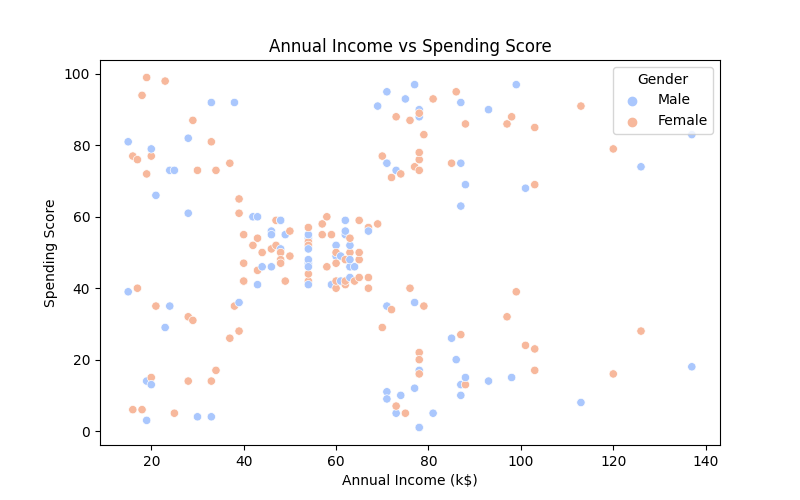
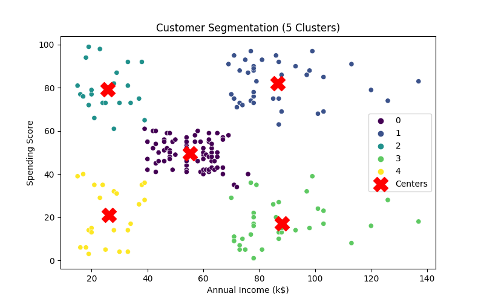

# 🏆 Customer Segmentation with Hierarchical Clustering

This project uses the **K-Means Clustering** algorithm for **customer segmentation**.

## 🚀 Technologies Used
- Python
- Pandas, NumPy
- Scikit-learn
- Matplotlib, Seaborn

## 📊 Dataset
The dataset is located in `data/customers.csv`. It contains the following columns:
- `Age`: Customer's age
- `Annual Income (k$)`: Annual income (k$)
- `Spending Score (1-100)`: Spending score

## 📌 How to Run?
1. Install the required libraries:
   ```bash
   pip install -r requirements.txt
   ```
   Open the **Customer_Segmentation.ipynb** file and follow the steps.


# 📈 Results
Using dendrogram analysis, 5 clusters were determined.
Customers were grouped based on income and spending habits.

## Visualizations:




# 📈 Analysis

## Cluster 0 → Middle-Income, Moderate Spending
### This segment includes middle-aged customers with moderate income and spending habits. They are stable, loyal clients who are likely to engage with long-term loyalty programs. This group represents a key demographic for consistent revenue and can be retained with targeted offers and rewards.

## Cluster 1 → VIP Customers (Wealthy, High Spending)
###This cluster consists of younger to middle-aged customers with high income and spending scores. They exhibit significant purchasing power and can be attracted with exclusive luxury services, personalized experiences, and tailored promotional campaigns that cater to their elevated needs and preferences.

## Cluster 2 → Young and Low Income, Yet High-Spending Potential
### Younger customers in this group have lower income levels but demonstrate a strong inclination towards spending. They are likely to be interested in student discounts, value-driven offers, and campaigns that specifically target younger audiences with cost-effective yet appealing products.

## Cluster 3 → High-Income, Low-Spending (The Savers)
### This segment represents high-income individuals who show limited spending behaviors. These customers may be inclined to invest in premium products, exclusive investment opportunities, or luxury services that appeal to their financial security and desire for high-value, long-term purchases.

## Cluster 4 → Low-Income, Low Spenders (Frugal Customers)
### This group includes middle-aged individuals with low income and minimal spending habits. They are highly cost-conscious and would respond best to discounted products, value-driven offers, and economical packages that align with their financial constraints.
