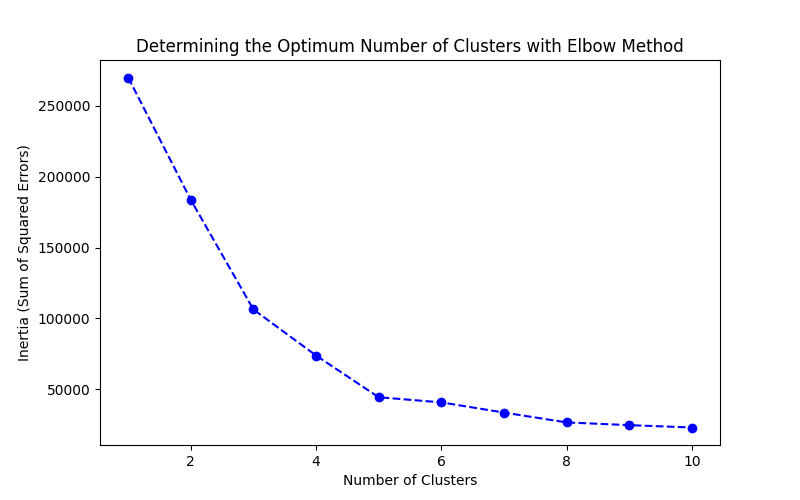

# 🏆 Customer Segmentation with Hierarchical Clustering

This project uses the **K-Means Clustering** algorithm for **customer segmentation**.

## 🚀 Technologies Used
- Python
- Pandas, NumPy
- Scikit-learn
- Matplotlib, Seaborn

## 📊 Dataset
The dataset is located in `data/customers.csv`. It contains the following columns:
- `Age`: Customer's age
- `Annual Income (k$)`: Annual income (k$)
- `Spending Score (1-100)`: Spending score

## 📌 How to Run?
1. Install the required libraries:
   ```bash
   pip install -r requirements.txt
   ```
   Open the **clustering.ipynb** file and follow the steps.


# 📈 Results
Using dendrogram analysis, 5 clusters were determined.
Customers were grouped based on income and spending habits.

## Visualizations:




